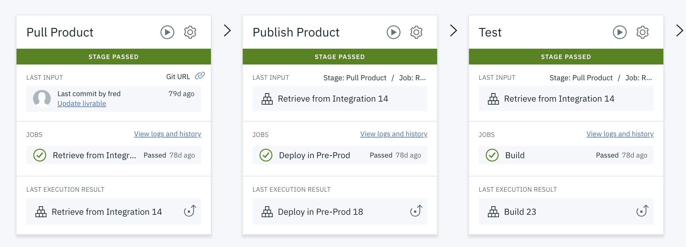

# API Connect on Cloud Devops pipeline


Create a new Toolchain with these Tools

- GitHub Enterprise Whitewater
- Delivery Pipeline
 
 
 

## Configure Github
-----
Repository type: <exiting or new>
Repository URL: https://github.ibm.com/frederic-dutheil/apic-devops

Check or not :

- Enable GitHub Issues
- Track deployment of code changes


## Configure pipeline
-----

 

## Stage : Pull Product

### Input

Input Settings :

Input Type : **Git Repository**


Git repository: **apic-devops**

Git URL : **https://github.ibm.com/frederic-dutheil/apic-devops.git**

Branch **Master**


Stage Trigger --

**Run jobs only when this stage is run manually**

### Job

Title : **Retrieve from Integration**

Builder Type (Build) : **npm**

Build script

```
#!/bin/bash
# The default Node.js version is 0.10.40
# To use Node.js 0.10.48, uncomment the following line:
#export PATH=/opt/IBM/node-v0.10.48/bin:$PATH
# To use Node.js 0.12.7, uncomment the following line:
#export PATH=/opt/IBM/node-v0.12/bin:$PATH
# To use Node.js 4.4.5, uncomment the following line:
#export PATH=/opt/IBM/node-v4.4.5/bin:$PATH
# To use Node.js 6.7.0, uncomment the following line:
export PATH=/opt/IBM/node-v6.7.0/bin:$PATH
npm install

mkdir packages

# Read livrable.txt file in github repository
# livrable.txt file containt product name and version product to retrieve.

# Sample content of livrable.txt file
#product=apicsandbox-product
#version=1.0.0

FILE=./livrable.txt

if [ -f $FILE ]; then

   # Check if file exist and execute it to initialise product and version variables
   
   echo "File $FILE exists."
   . $FILE

   echo "Product: $product , Version: $version"
   cp $FILE packages/topublish
   
   #echo "#### npm install fo apiconnect cli from internet npm repository"
   npm install -g apiconnect
   
   echo "y" | apic
   echo "n" | apic

   apic --ext-version
   
   cd packages

   # log to apiconnect saas instance
   apic login --server $apic_srv -k  $icapikey
   
   # Sample for pull product api with apic cli
   # apic drafts:pull "frk1-product:1.0.0" --server $apic_srv --organization $org

   apic products:pull $product:$version --server $apic_srv --organization $org --catalog $catalog
   
   # product and api yaml files are retrieved in the working "packages" directory
   

else

   # if file not exist, add empty named "nopublish" in the working "packages" directory
   
   echo "File $FILE does not exist."
   touch packages/nopublish
fi
```

Build archive directory : **packages**


### Environment properties

- catalog : **integration**
- org : **fdutorg-dev**
- apic_srv : **eu-de.apiconnect.ibmcloud.com**
- icapikey : **.............................**


## Stage : Publish Product

### Input

Input Settings :

Input Type : **Build Artefact**

Stage : **Pull Product**

Job : **Build**


Stage Trigger : **Run jobs when the previous stage is completed**

### Job

Title : **Deploy in Pre-Prod**

Builder Type (Build) : **npm**

Build script

```
#!/bin/bash
# The default Node.js version is 0.10.40
# To use Node.js 0.10.48, uncomment the following line:
#export PATH=/opt/IBM/node-v0.10.48/bin:$PATH
# To use Node.js 0.12.7, uncomment the following line:
#export PATH=/opt/IBM/node-v0.12/bin:$PATH
# To use Node.js 4.4.5, uncomment the following line:
#export PATH=/opt/IBM/node-v4.4.5/bin:$PATH
# To use Node.js 6.7.0, uncomment the following line:
export PATH=/opt/IBM/node-v6.7.0/bin:$PATH
npm install

echo "--- pwd --"
pwd
ls -l

if [ -f nopublish ]; then
   echo "File nopublish exists. So nopublish"
else
   echo " --  Start deployment --"
   . topublish

   echo "Product: $product , Version: $version"
   product2publish=${product}_product_${version}.yaml
   
   echo "product to publish: $product2publish"
   echo "#### npm install -g apiconnect"
   npm install -g apiconnect

   echo "y" | apic
   echo "n" | apic
   apic --ext-version
   
   echo "-- APIC Login --"
   apic login --server $apic_srv -k $icapikey

   #Clean all product
   apic products:clear --server $apic_srv --organization $org --catalog $catalog --confirm $catalog

   # Sample for publish with apic cli
   # apic products:publish fr1-product_product_1.0.0.yaml --server eu-de.apiconnect.ibmcloud.com --organization fdutorg-dev --catalog pre-production
   
   apic products:publish $product2publish --server $apic_srv --organization $org --catalog $catalog
fi
```

Run conditions :  **Stop running this stage if this job fails**


### Environment properties

- catalog : **pre-production**
- org : **fdutorg-dev**
- apic_srv : **eu-de.apiconnect.ibmcloud.com**
- icapikey : **.............................**

## Stage : Test

### Input

Input Settings :

Input Type : **Build Artefact**

Stage : **Pull Product**

Job : **Retrieve from Integration**


Stage Trigger : **Run jobs when the previous stage is completed**

### Job

Title : **Test API**

Builder Type (Build) : **Shell script**

Build script

```
#!/bin/bash
# your script here
sudo apt-get update
sudo apt-get -y install jq

echo "-- Test API --"
resp=$(curl -ks "https://api.eu-de.apiconnect.ibmcloud.com/fdutorg-dev/integration/bank/v1/getQuote?symbol=IBM" --header 'accept: application/json' --header 'x-ibm-client-id: be42d5b4-af18-4f37-90c6-27a8d6693ac6' |  jq .httpCode | sed -e s/\"//g )

echo "-- Show response --"
echo "resp: $resp"

if [ "$resp" == "null" ] 
then
 # Test if resq=null 
 echo "Test OK"
else
 echo "Test KO"
 exit 1
fi
```

