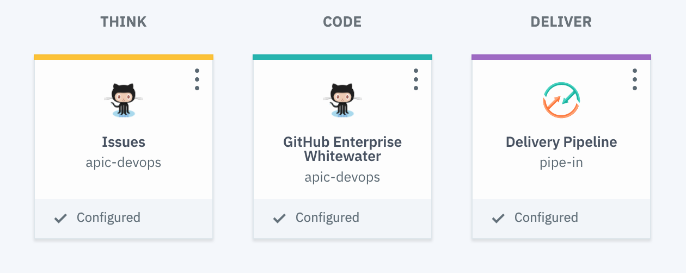
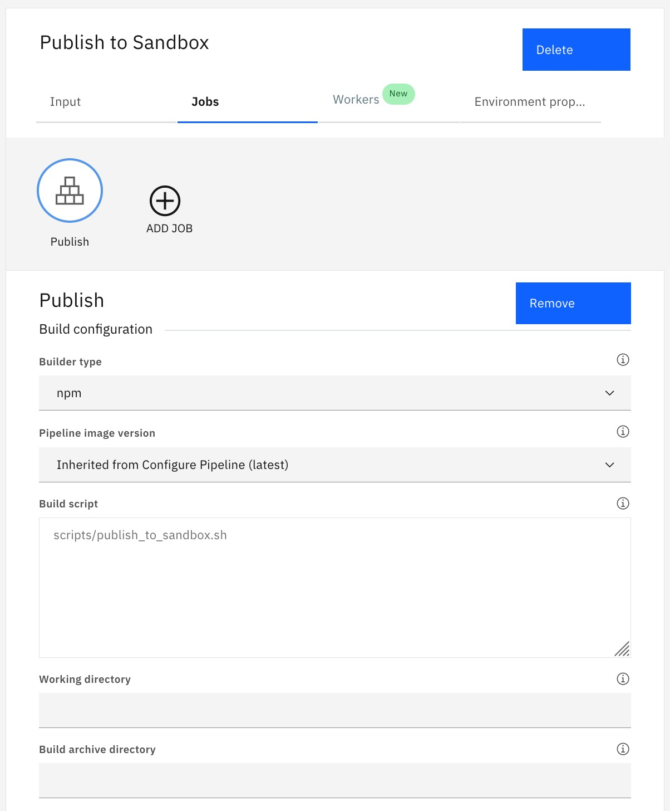
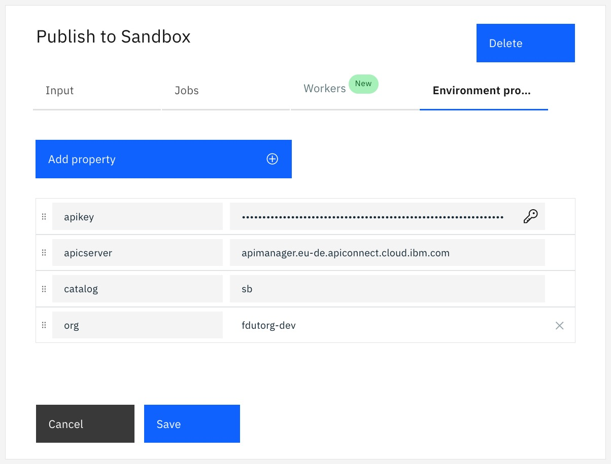

# API Connect on Cloud Devops pipeline

The sample show how to use API Connect CLI for Continious Delivery in IBM Cloud pipeline.

Scope : API Connect on Cloud (v5) and API Connect Toolkit 

- APIC (v5) CLI : https://www.ibm.com/support/knowledgecenter/SSMNED_5.0.0/com.ibm.apic.toolkit.doc/rapim_cli_command_summary.html
- Toolchain : https://cloud.ibm.com/devops/toolchains


## Create a new Toolchain with these Tools

- GitHub repository
- Delivery Pipeline
 
 
 

## Configure Github
-----
Repository type: <exiting or new>
Repository URL: https://github.com/fdut/apiconcloud-devops

Check or not :

- Enable GitHub Issues
- Track deployment of code changes


## Configure pipeline
-----

## Stage : Publish Product

### Input

Input Settings :

Input Type : **Git Repository**


Git repository: **apiconcloud-devops**

Git URL : **https://github.com/fdut/apiconcloud-devops**

Branch **Master**


Stage Trigger --

**Run jobs only when this stage is run manually**

### Job

Title : **Publish to Sandbox**

Builder Type (Build) : **npm**

Build script

```
scripts/publish_to_catalog.sh
```



### Environment properties

```
(secure property)
- apikey : **.............................**
```

(optional to replace apic.properties values)
```
(Text property)
- apiserver
- catalog
- org 
```
 


---
2020 - Fred Dutheil